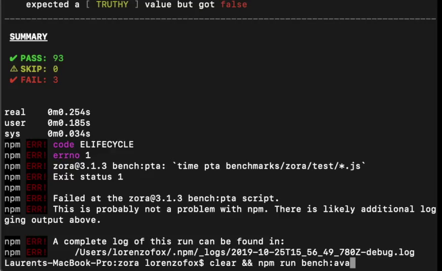
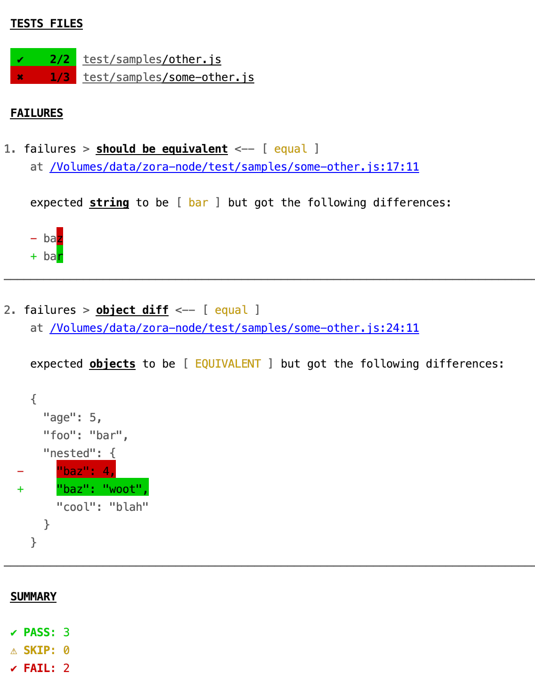

# zora-node

[](https://circleci.com/gh/lorenzofox3/zora-node)

Test runner for nodejs using [zora](https://github.com/lorenzofox3/zora) testing library.

## Points of interest

* zero config

* one of the lightest

|        |  pta  |  tape |  Jest  |  AVA  |  Mocha|
|--------|:-----------:|:-----------:|:-------------:|:------------:|:------------:|
|Install size | [](https://packagephobia.now.sh/result?p=pta)  |[](https://packagephobia.now.sh/result?p=tape)  |  [](https://packagephobia.now.sh/result?p=jest) |  [](https://packagephobia.now.sh/result?p=ava) |  [](https://packagephobia.now.sh/result?p=mocha) |

* yet the fastest

See the user experience when running a test program made of 12 files with 8 tests compared to other popular frameworks.
A test being:
```javascript
    test('test', async function (assert) {
        await new Promise(resolve => {
            setTimeout(() => resolve(), 50); //wait 50 ms (database is processing, etc)
        });
        assert.truthy(Math.random() * 100 > 3); // fails 3% of the time
    });
``` 
<details>
    <summary>Animated screen shots of diverse user experiences</summary>



</details>

* Support esm module syntax with no extra bundling step (thanks to [esm module](https://www.npmjs.com/package/esm)) 

* Effective reporters, perfect to find out about errors ("where", "what" and "why"). Not extra noise, fancy code highlights, etc ... straight to the point!

* All the goodies from [zora](https://github.com/lorenzofox3/zora)

## Usage

Write your spec files with a default export function taking as argument a zora's assertion object

``./test/foo.js``
```javascript
export default (t) => {
    t.test(`should greet`, t => {
        t.ok(true, 'hello world');
    });
}
``` 

and run with the cli:

``pta``

More info about the CLI options can be found in [usage](src/usage.txt)

## Reporters

### default

A reporter which takes advantage of TTYs to create very informative, straight to the point reports:

1. A test files diagnostic
2. A diagnostic per failing assertion (with location, semantic structure, and detailed difference between expected and actual value)
3. A summary counter.

<details>
    <summary> Report screen shot</summary>



</details>

### log

Dump JSON stringified zora's protocol messages. It is very convenient if you want to create a custom reporter. In modern versions of node it has been trivial to write transform streams thanks to Async Iterators:

consider the following 20 lines program 
```javascript
#!/usr/bin/env node
const readline = require('readline');
const {stream} = require('@lorenzofox3/for-await');

async function processLineByLine(input = process.stdin) {
    const inputStream = stream(
        readline.createInterface({
                input
            }
        ))
        .map(m => JSON.parse(m))
        .filter(m => m.type === 'ASSERTION' && m.data.pass === false);

    for await (const m of inputStream) {
        console.log(m.data);
    }
}

processLineByLine();
```

That's it. You have a custom reporter (whose package's name is "custom-reporter" for example) which prints in the console the failing assertions' details. 

``pta -r log | custom-reporter``

### tap

A flatten [TAP](http://testanything.org/) (Test Anything Protocol) stream in the same format as [tape](https://github.com/substack/tape) produces. Can be parsed and piped into one (of the plenty) custom reporter available in npm (or any other technology's package registry - tap is widely spread).

Example with [faucet](https://www.npmjs.com/package/faucet):

``pta -r tap | faucet``

### tap-indent

Another common structure of tap stream (used by [node-tap](http://node-tap.org/)). The structure can be parsed with common tap parser (such as [tap-parser](https://github.com/tapjs/tap-parser)) And will be parsed as well by tap parser which
do not understand the indentation. However to take full advantage of the structure you should probably use a formatter (such [tap-mocha-reporter](https://www.npmjs.com/package/tap-mocha-reporter)) aware of this specific structure to get the whole benefit
of the format.

Example with [tap-mocha-reporter](https://www.npmjs.com/package/tap-mocha-reporter)

``pta -r tap-indent | tap-mocha-reporter classic``

## Code coverage

We recommend to use [c8](https://www.npmjs.com/package/c8): 

``c8 pta``

## Watch mode

We recommend to use

``chokidar-cli "{src,test}/*.js" -c "pta"``